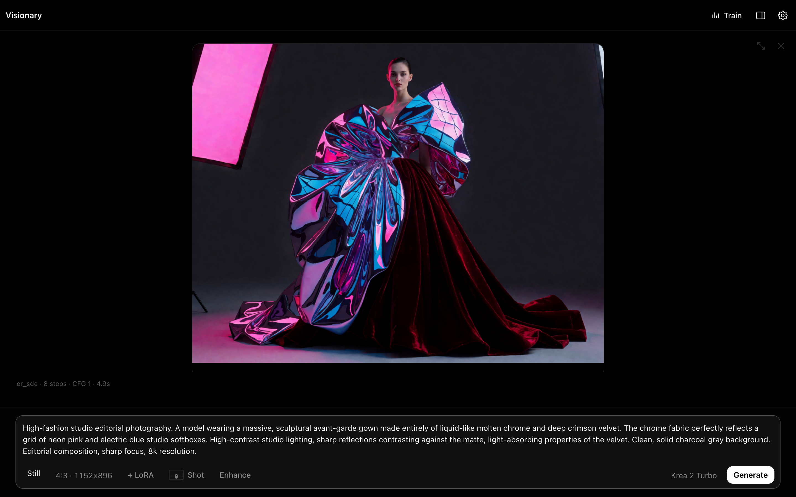
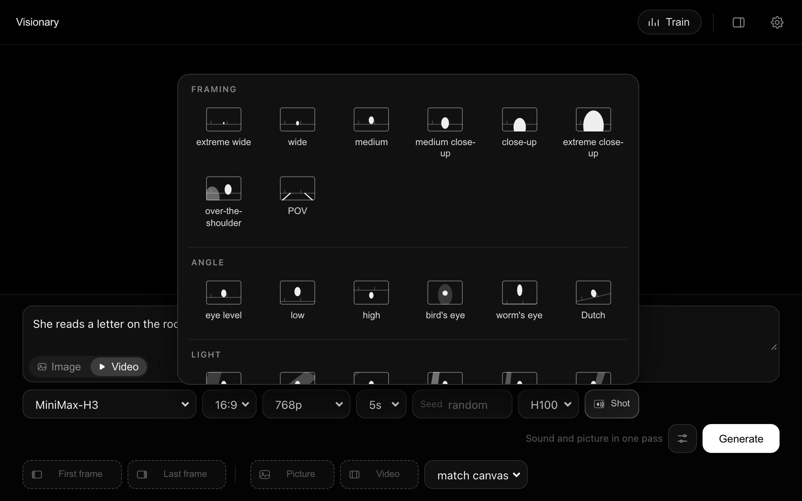
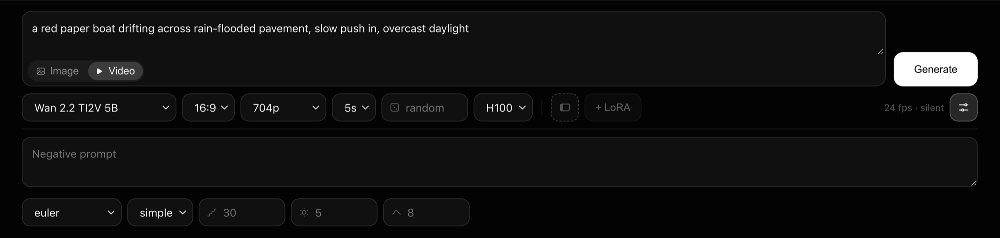
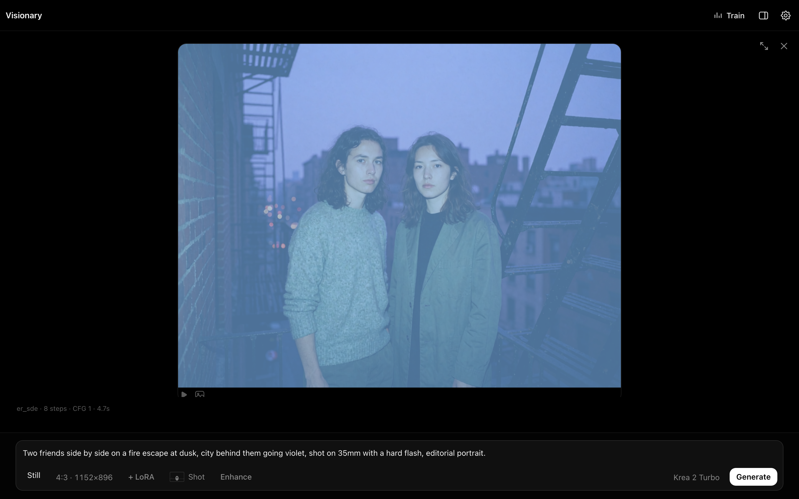
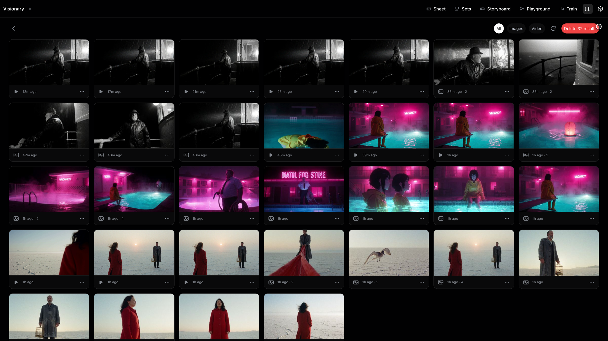
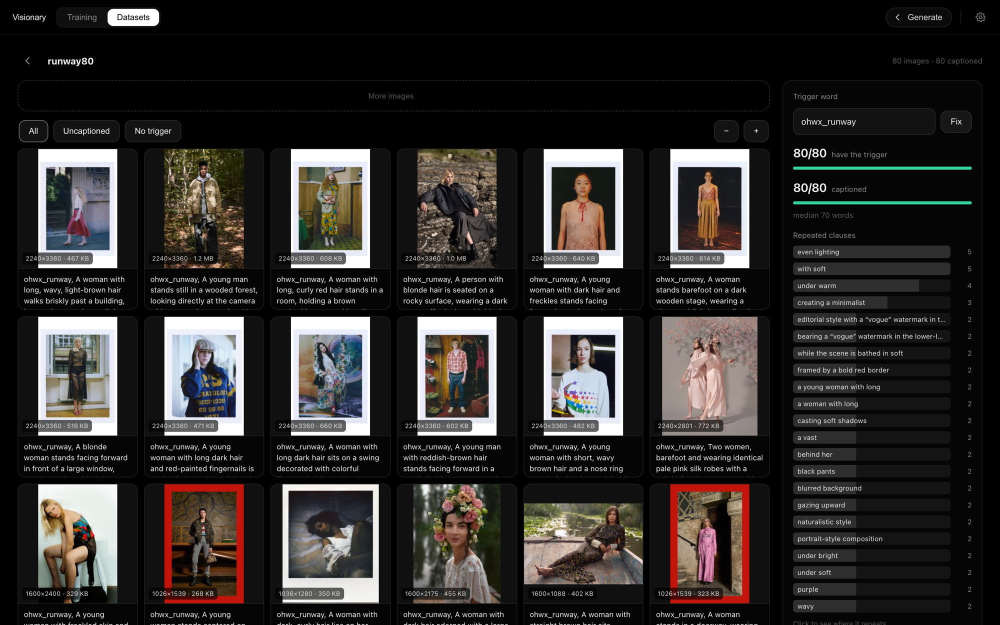

# Visionary

A generative studio that runs on your own [Modal](https://modal.com) account.
Train a LoRA on your own photographs, generate stills with it, and animate any
of them into a clip — one interface, one URL, nothing to keep running between
sessions.



```bash
pip install modal
modal setup
modal deploy app.py
```

That is the whole install. The last command prints a URL, and the URL is the
application — interface, API and GPU jobs. Nothing runs on your machine, nothing
runs while you are not using it.

---

## What you can do

**Generate stills and video in one workspace.** Image and video share a prompt,
a canvas and a gallery. Duration is the switch: `Still` runs Krea 2, any length
runs MiniMax-H3. The controls on screen follow the model, so you only ever see
the ones it actually reads.

**Write prompts as pills, not paragraphs.** Camera moves, framing, lighting,
tone and audio come from a palette of animated tiles — a tile *shows* you a
dolly-out rather than making you guess the wording. The prompt field keeps only
what nothing else can say: who is in the shot and what happens. A live preview
shows the exact string the model will be handed.

**Let the model finish a fragment.** Type `empty diner, 3am`, press **Enhance**,
and it comes back as a written prompt with the light placed and the clock still
reading 3am. ⌘Z or the Undo beside the button restores your words exactly. The
rewrite runs on Krea 2's own text encoder — already loaded during a session — so
it writes in the same dialect it reads.

**Place multiple characters with regional LoRAs.** Draw a box on the frame, drop
a `<lora:name:1.3>` into it, and that LoRA applies only inside the box — two
trained identities stay separate instead of blending. Each box can also take a
reference photo; drop a photo on the bare canvas instead and it becomes the
scene the picture is generated inside.

**Train your own LoRAs.** Point the trainer at a folder of images and get a
`.safetensors` back. Runs live on a board rather than taking over a screen, so
you can **train several at once** — each is its own card showing live epoch,
step, rate and loss, and a finished card hands its LoRA files straight to the
LoRA picker. Start a run, add another, and leave; status is read off each job's
heartbeat, so a card reports what actually happened even if a container was
killed mid-step.

**Prepare datasets in the same place.** Images get prose captions from
Qwen3-VL-8B, with presets tuned to what you're training (character, style,
concept). A panel reads the set back to you — trigger-word coverage, caption
length, repeated clauses — and duplicate detection flags copies before they
train unevenly.







---

## Requirements

- A Modal account. `modal setup` walks you through auth in a browser.
- Python 3.10+ locally, only to run the `modal` CLI.
- A [HuggingFace](https://huggingface.co) account **if** you want Krea 2 — its
  weights are gated. Everything else downloads without one.

You do not need a local GPU, Docker, a `.env` file, or any Modal Secret. The
HuggingFace token is pasted into the UI and stored in a Modal Dict.

---

## First run: get the weights

A fresh deployment has an empty volume — nothing downloads on its own, because
the full catalogue is ~206 GB and almost nobody wants all of it. Open the
deployed URL, click the gear, and pick what you need.

| Family                       |   Size | Gated | What it buys                              |
| ---------------------------- | -----: | ----- | ----------------------------------------- |
| Krea 2 — images              |  62 GB | yes   | training + still generation               |
| MiniMax-H3 — video           |  64 GB | no    | video **with a soundtrack**, references   |
| MiniMax-H3 speed LoRAs       |   3 GB | no    | fewer steps per clip                      |
| Krea 2 style LoRAs           |   4 GB | no    | Krea's own nine styles, for the prompt    |

You do not need a whole family. Video without references is the base set — the
fl2va transformer, the text encoder and the two VAEs — and the ref2va
transformer is one extra file on top of it rather than a second stack.

The **style LoRAs** are the cheapest way to see regional prompting work: put two
styles in two boxes and the hard seam between them — ink wash on one side,
motion blur on the other — is the masking, made visible.

Downloads run on CPU containers, never on a GPU, and report the bytes and rate
as they go. A transfer that goes quiet for four minutes is abandoned and resumed
from where it stopped, up to five times.

### Gated weights

Krea 2 RAW and Krea 2 Turbo need a HuggingFace token, and you must accept the
licence with the same account that issued it:

- <https://huggingface.co/krea/Krea-2-Raw>
- <https://huggingface.co/krea/Krea-2-Turbo>

Paste the token under the gear. If the licence has not been accepted, the error
says so and links the page rather than failing as a generic 403.

### LoRAs from Google Drive

Most LoRAs worth having were never published to HuggingFace — they are a link
someone sent you. Paste one under the gear and it lands in `loras/`, ready to
name in a prompt.

- A file link, a bare id, or a folder link all work.
- Only `.safetensors` is kept; a folder's preview grid and readme are skipped.
- Leave **folder** blank and files drop in loose, each its own entry. Give one
  and they are grouped as versions of a single LoRA under `loras/{folder}/`.
- The link must be shared with anyone who has it. An unshared file is named as
  that case explicitly, rather than surfacing a parse error.

---

## What runs underneath

**Train.** LoRA training for Krea 2 on
[musubi-tuner](https://github.com/kohya-ss/musubi-tuner). Point it at a folder
of images, get a `.safetensors` back. Each run loads its own weights and writes
its own output folder, so several train concurrently — the trainer is the one
GPU class here with no single-container pin.

**Caption.** Datasets are named folders of images with `.txt` sidecars beside
them — exactly what the trainer reads.

**Generate stills.** Krea 2 inference through a driven ComfyUI, with LoRA
stacking and regional multi-character LoRA.

**Generate video.** MiniMax-H3 through a driven ComfyUI — sound and picture in
one pass, from text, from a first and/or last frame, or from up to twelve
references (pictures, video and audio) through the ref2va transformer. It is
guidance-distilled, so there is no CFG and no negative prompt; LoRAs load
through `LoraLoaderModelOnly` like anything else, including MiniMax's own
Lightning distillations.

A second family (Wan 2.2) shared this path for a while and was removed. What it
proved is worth keeping: the container, the warm ComfyUI process and the job
contract are family-agnostic, so what a family costs is a graph builder and a
row of capabilities — the same row the UI reads to decide which controls to
show.

---

## Storage

One Modal Volume, mounted at `/workspace`:

```
models/               weights, flat, addressed by exact filename
loras/                trained LoRAs, one folder each; loose files work too
datasets/{name}/      images + .txt caption sidecars
outputs/{job}/        generated media + a visionary.json sidecar
work/, .cache/        disposable
```

The layout is the contract: datasets are folders of images with text files
beside them, so nothing here is required to get your data back out.

Run a second, isolated copy against its own storage by setting the volume name:

```bash
VISIONARY_VOLUME=visionary-test modal deploy app.py
```

---

## GPUs and cost

Each job type picks its own class, and most are switchable in the UI:

| Job              | Default   | Options    |
| ---------------- | --------- | ---------- |
| Training         | A100-40GB | —          |
| Captioning       | A100-40GB | —          |
| Image generation | H100      | H100, H200 |
| Video generation | H100      | H100, H200 |

Image and video generation share one image whose SageAttention kernels are
compiled for Hopper, so both want an H100/H200 — an A100 would run slow.

Containers stay warm between requests (10 minutes for images, 15 for video) so
consecutive takes skip the model load, then scale to zero. You are billed for
GPU time while a job runs and while a container is warm — not for an idle
deployment. Bad inputs (a wrong LoRA path, an unknown aspect ratio, a missing
weight) are rejected on CPU in milliseconds, before a GPU is rented.

---

## Verifying a deployment

Four smoke tests, all cheap, all runnable against your own account:

```bash
modal run tools/smoke_graphs.py     # every graph validates against ComfyUI's node schema (CPU, no weights)
modal run tools/smoke_caption.py    # every captioner repo id resolves and parses (CPU); --gpu captions a real image
python3 tools/smoke_prompt.py       # the shot compiler matches MiniMax's published format (stdlib, no network)
python3 tools/smoke_pins.py         # every pinned wheel still resolves, before a deploy spends 20 minutes finding out
```

### What has been run end to end

Being honest about coverage, since "it deploys" is not "it works":

- **MiniMax-H3** — text-to-video run end to end on an H100. The compiler output
  is checked against the published format by `smoke_prompt.py` and scored 1.00
  against MiniMax's own format grader. Still unverified by ear: whether
  `non_diegetic_music: N/A` actually silences the soundtrack.
- **The scene composer** — driven and read, never measured against a render.
  `tools/prompt_ab.py` is the measurement that is not a proxy and has not run.

---

## Working on the UI locally

The front end is React and TypeScript under `web/`, built by Vite into the image
at deploy time — so `modal deploy app.py` stays the whole install and no local
Node is needed to ship. For development, `npm run dev` in `web/` proxies to
`tools/preview_ui.py`, which serves the real prompt compilers and shot vocabulary
against stubbed jobs, so the entire UI is workable with no Modal account, no GPU
and nothing billed:

```bash
python3 tools/preview_ui.py
```

---

## Layout

```
app.py              the whole application — images, jobs, API, and the UI
comfy_nodes/        our own ComfyUI nodes — one shim, see visionary_boxes
tools/              smoke tests and the local UI preview server
tools/_from_app.py  pulls plain-Python pieces out of app.py by AST
CLAUDE.md           the design rationale — why the code is shaped the way it is
```

`app.py` is deliberately one file — long, but navigable by its banner comments,
and it keeps `modal deploy app.py` the whole install. If you are going to change
anything, read `CLAUDE.md` first: it explains the tradeoffs the code is holding,
several of which look like mistakes until you know what they avoid.

---

## Licensing

**[AGPL-3.0](LICENSE).** Strong copyleft with a network-use clause: section 13
means that if you modify this and let other people use it over a network, you owe
those users the corresponding source — deploying, not just distributing, counts.
Since this deploys as a web application by design, that is the normal case here.
Running your own private instance triggers nothing.

The images install, rather than vendor, two upstreams:

- **[ComfyUI](https://github.com/Comfy-Org/ComfyUI)** — GPL-3.0. Cloned at
  `COMFY_SHA`, run as its own process, driven over its HTTP API. Not linked
  against or patched.
- **[Krea2 Regional Multi-LoRA](https://github.com/CliffNodes/Krea2-Multi-Character-Lora-Node-with-bounding-box-Scene-and-Outfit-Edit)**
  — MIT. Cloned at `CLIFF_SHA` into ComfyUI's `custom_nodes/`, unmodified.

None of this is legal advice. Model weights carry their own separate licences —
Krea 2's in particular is gated and has terms you accept on HuggingFace. Nothing
here grants you rights to them.
