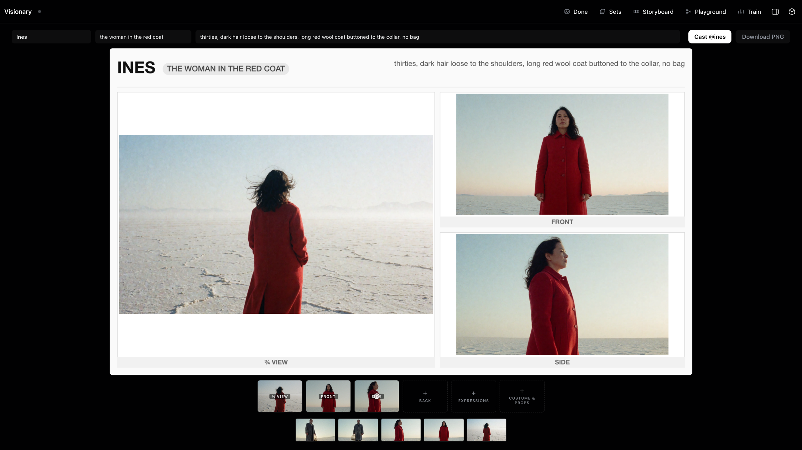
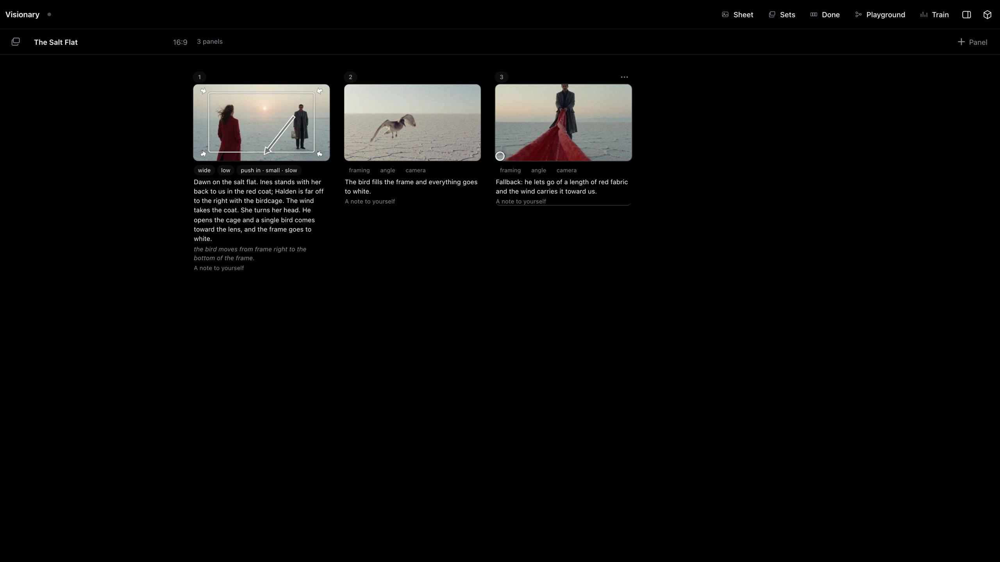
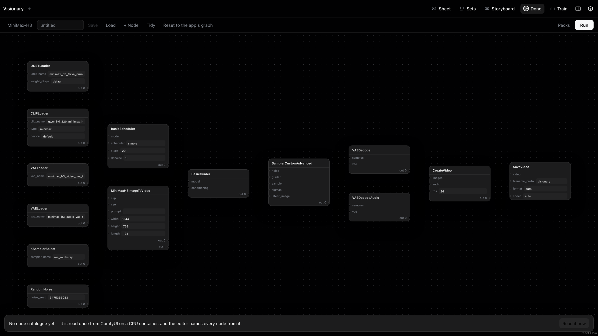

# Visionary

A generative studio that runs on your own [Modal](https://modal.com) account.
Train a LoRA on your own photographs, make stills and clips with it, cast the
people you trained into scenes, and lay the scenes out on a storyboard —
nothing to keep running between sessions.


```bash
pip install modal
modal setup
modal deploy app.py
```

That is the whole install on this side. The last command prints a URL, and the
URL is training, inference, the stored weights and one job API behind Modal
proxy auth. Nothing runs while you are not using it, and a GPU starts when a
job is submitted and at no other time.

> **The front end was retired on 2026-09-09**, and the pictures in this file
> are of it. What deploys from `main` today is the engine and the seam: no
> HTML, no static files, nothing a browser would open. Retirement is not
> deletion — the whole Modal-served application, `app.py` with the web build
> in its image and `web/` as the front end it served, is kept on the
> [`modal-web`](../../tree/modal-web) branch, deployable as it was, because it
> is a solid artefact of what can be built on Modal alone and the record of a
> year of decisions. Nothing is developed on it and it is never rebased.
>
> **Read the next section as a description of that application**, because it is
> one: where it names a button or a console, that is the surface on `modal-web`.
> The capabilities under them are the platform's and still deploy from `main` —
> the training, the two model families, regional LoRA, the compilers, the
> Playground's engine — reached through the job API instead of a page.
> `docs/roadmap.md`, Phase 7, has the account, including the five capabilities
> that were moved onto the job API rather than allowed to fall between the two
> halves.

---

## What you can do

**Two disciplines, one canvas, one gallery.** The photographer's console runs
Krea 2; the filmmaker's runs MiniMax-H3. Each keeps its own composer — switch
away and back and everything is as you left it — and the model button is the
door between them. Duration starts at zero: `Still` is a photograph, and both
consoles answer it. On the video side a still is a film still, a short H3
sequence with one frame kept, so a cast, its references and its voices survive
the moment you only want one picture. Adding seconds is the only thing that
moves you to the other engine.

**Write prompts as pills, not paragraphs.** Framing, angle, light, tone,
camera, speech, sound and score come from a palette of eighty animated tiles —
a tile *shows* you a dolly-out rather than making you guess the wording. What
you type keeps only what nothing else can say: who is in the shot and what
happens. Nobody types a text encoder's grammar. What the model actually reads
is one fold away under the console, set as quiet prose and produced by the same
code the run uses.

**Cast a scene by typing `@`.** The video side has no prompt box, because H3
reads a document rather than a sentence — shots, cut times, and who is speaking
in each. Type `@` mid-sentence and a picker floats off the caret; picking makes
a cast member and drops their name into the prose. Hand them a photograph and
it is what they look like, a recording and it is what they sound like, a
trained LoRA and it is who they are. A shot's slice of the clip is the length
of what you wrote about it. Write one shot, cast nobody, and the run is your
typed text byte for byte.

**Keep the people you make.** A character saved from the composer becomes a
folder on your volume — their pictures, their voice, a note you can read in a
terminal, and a pointer at their LoRA. Recall one by typing their name in
either console. A **Sheet** door composes a labelled character reference sheet
from your own generations, the form H3's guide asks for when one picture has to
carry several views of somebody.

**Storyboard the scene.** Behind its own door, a wall of strictly ordered
panels: prose, a note, and a picture pinned from the gallery or dropped in.
There is no duration anywhere on the board — pacing lives in the prose, and
seconds belong to generations. A panel carries a shot's own pills, the camera's
move is drawn on the frame in the industry's own stencil language, and a
subject's move is a hollow arrow that writes the sentence you would otherwise
have to. Two selected panels become a first-and-last-frame take; the whole
board becomes a scene. Boards are folders, and copying one in is the import.

**Place multiple characters with regional LoRAs.** Double-click the frame to
place a box, or recall a saved character straight into one, and pick a LoRA on
the card that box opens: it applies only inside the box, so two
trained identities stay separate instead of blending. Each box can also take a
reference photo. "Edit this image" on any render makes it the scene the next
one composes into — with scene and outfit plates, a fidelity number and a
per-box likeness anchor once the identity-edit LoRA is downloaded — and a
style reference carries a look across without a weight at all.

**A scene is longer than a take.** H3 renders about fourteen seconds at a
time. `Continue` opens the next take on the last frame of the one that landed,
with the cast, their photographs and their voices already in place; motion and
audio genuinely carry across the join, and `Export scene` stitches the takes
into one file on a CPU container.

**Train your own LoRAs.** Point the trainer at a folder of images and get a
`.safetensors` back. Runs live on a board rather than taking over a screen, so
you can **train several at once** — each is its own card showing live epoch,
step, rate and loss, and a finished card hands its files straight to the LoRA
picker. Every hyperparameter carries its name. Start a run, add another, and
leave; status is read off each job's heartbeat, so a card reports what actually
happened even if a container was killed mid-step.

**Prepare datasets in the same place.** Drop images and you have a draft;
Save is the one gesture that reaches the volume. JoyCaption writes prose
captions — the house instruction runs whole, or you write your own from blank,
and nothing is composed around it that you cannot see. A panel reads the set
back to you — trigger-word coverage, caption length, repeated clauses — find
and replace runs across the sidecars, and duplicate review separates *copies*
(a keeper already chosen) from *similar* photographs (nothing preselected,
because a burst is legitimately useful).

**Open the hood in the Playground.** A node room over the same engine: it
opens on the exact graph the app itself would run, and you rewire it, add
nodes, install packs from git, and run the result on the same warm GPU.
Workflows save as plain API-format JSON on your volume, every render embeds
its own graph the way ComfyUI does — the PNG *is* the workflow, droppable back
onto the room — and a saved workflow can stand in for the built-in graph from
the model menu, with the console still compiling your prompt into it.









---

## Requirements

- A Modal account. `modal setup` walks you through auth in a browser.
- Python 3.10+ locally, only to run the `modal` CLI.
- A [HuggingFace](https://huggingface.co) account **if** you want Krea 2 — its
  weights are gated. Everything else downloads without one.

You do not need a local GPU, Docker, Node, a `.env` file, or any Modal Secret.
The HuggingFace token is pasted into the UI and stored in a Modal Dict.

---

## First run: get the weights

A fresh deployment has an empty volume — nothing downloads on its own, because
the full catalogue is ~133 GB and almost nobody wants all of it. Open the
deployed URL, click the gear, and pick what you need. A family downloads as one
job, in order.

| Family                        |   Size | Gated | What it buys                                       |
| ----------------------------- | -----: | ----- | -------------------------------------------------- |
| Krea 2 — images               |  64 GB | yes   | training + still generation; the identity-edit LoRA (1.8 GB, ungated) is optional and adds scene and outfit transfer |
| MiniMax-H3 — video with sound |  64 GB | no    | video **with a soundtrack**, keyframes, references |
| MiniMax-H3 speed LoRAs        |   6 GB | no    | 8-step and 4-step takes                            |

You do not need a whole family. Video from text or keyframes is the base set —
the fl2va transformer, the text encoder and the two VAEs — and the ref2va
transformer is one extra 21 GB file on top of it rather than a second stack.

Downloads run on CPU containers, never on a GPU, and report the bytes and rate
as they go. A transfer that goes quiet for four minutes is abandoned and
restarted, up to five times.

### Gated weights

Krea 2 RAW and Krea 2 Turbo need a HuggingFace token, and you must accept the
licence with the same account that issued it:

- <https://huggingface.co/krea/Krea-2-Raw>
- <https://huggingface.co/krea/Krea-2-Turbo>

Paste the token under the gear. If the licence has not been accepted, the error
says so and links the page rather than failing as a generic 403.

### LoRAs from Google Drive, HuggingFace, or your disk

Most LoRAs worth having were never published anywhere — they are a link
someone sent you. The LoRAs section of Settings has three ways in, each folded
to one row until you press it, and every LoRA lands in `loras/`, ready to pick
as a chip.

- **Google Drive.** A file link, a bare id, or a folder link all work, and a
  folder is listed before it is pulled so a repaste costs only the difference.
  The link must be shared with anyone who has it; an unshared file is named as
  that case explicitly, rather than surfacing a parse error.
- **HuggingFace.** `owner/repo`, or a link to a file in one. The repo is
  listed first, so a repaste fetches only what is new; a private repo needs
  the token saved. A repo holding more than twenty weights is refused with
  the count — name the file you want.
- **This computer.** Choose `.safetensors` files and press Import. The upload
  reports its bytes as it goes.

Only `.safetensors` is kept; a folder's preview grid and readme are skipped.
Leave **folder** blank and files drop in loose, each its own entry. Give one
and they are grouped as versions of a single LoRA under `loras/{folder}/`.

Every LoRA row has the way back out: download a file to your disk, or push the
whole LoRA to a **private** repo under your HuggingFace account — created if it
does not exist, with the saved token, which needs write access. Nothing here
browses or recommends anyone else's weights; you paste what you were sent.

---

## What runs underneath

**Train.** LoRA training for Krea 2 on
[musubi-tuner](https://github.com/kohya-ss/musubi-tuner). Each run loads its
own weights and writes its own output folder, so several train concurrently —
the trainer is the one GPU function here with no single-container pin. Video
LoRA training is not built; H3 trains under a different trainer, and a dataset
already counts its clips so the storage contract will not change when it
arrives.

**Caption.** Datasets are named folders of images with `.txt` sidecars beside
them — exactly what the trainer reads. JoyCaption Beta One is the default
captioner; Qwen3-VL 8B stays in the menu because old runs name it, and its
Thinking checkpoint reasons before it writes, with the reasoning cut at
`</think>` and the token cap counted from there.

**Generate stills.** Krea 2 inference through a driven ComfyUI: LoRA stacking,
regional multi-character LoRA through a pinned node pack, the identity-edit
compose for scene and outfit plates, and training-free style-by-reference.

**Generate video.** MiniMax-H3 through the same ComfyUI — sound and picture in
one pass, from text, from a first and/or last frame, or from up to twelve
references (nine pictures, three videos, three voices) through the ref2va
transformer. It is guidance-distilled, so there is no CFG and no negative
prompt; LoRAs load through `LoraLoaderModelOnly` like anything else, including
MiniMax's own Lightning distillations, and a pinned motion-context pack carries
picture and sound across chained takes. There is no step cache on this path:
two were measured and both came out, one on cost and one because it distorted
trained identities.

A second video family (Wan 2.2) shared this path for a while and was removed.
What it proved is worth keeping: the container, the warm ComfyUI process and
the job contract are family-agnostic, so what a family costs is a graph builder
and a row of capabilities — the same row the UI reads to decide which controls
to show.

---

## Storage

Two Modal Volumes, and the layout under each is the contract. **Both hold
weights and nothing else.** A render is returned to the client and read back
by call id; a set is uploaded to a container's disk and handed to the job that
reads it. Neither reaches storage, and neither do thumbnails, caches or
anything else derived — the client's folder is the library, and everything
here is a copy in transit.

```
/workspace                          visionary
  loras/                            trained LoRAs, one folder each; loose files work too
  workflows/{name}.json             Playground graphs, plain ComfyUI API format
  playground_nodes/                 node packs installed from git, pinned by SHA
/models                             visionary-models — weights, flat, by exact filename
```

A render's record — the typed prose, the pills, the seed, what the encoder was
told — lives *inside* the file, as a PNG text chunk or an MP4 metadata key, so
a picture carries its own receipt wherever it lands. That matters more now
than it did: the file is the only copy that persists, because this side hands
the bytes over and keeps nothing. A set is a folder of images with text files
beside them. Nothing here is required to get your data back out.

Run a second, isolated copy against its own storage by setting the volume
names:

```bash
VISIONARY_VOLUME=visionary-test VISIONARY_MODELS_VOLUME=visionary-models-test modal deploy app.py
```

---

## GPUs and cost

Each job type picks its own class, and generation is switchable under the gear:

| Job                 | Default   | Options          |
| ------------------- | --------- | ---------------- |
| Training            | H100      | —                |
| Captioning          | A100-40GB | —                |
| Image generation    | H100      | H100, H200, L40S |
| Video generation    | H100      | H100, H200, L40S |
| Both, one container | H200      | H200, H100, L40S |

Image and video generation share one image, and its SageAttention kernels are
compiled for every card on these lists. What separates the cards is memory:
Krea 2 wants the headroom a regional render with reference photos peaks at,
and H3 is 42.5 GB of weights before any activations. L40S is the cheap 48 GB
card — a plain picture fits, a regional render with references may not, and
video runs with its weights paged and several times slower than an H100. An
out-of-memory error names the card it happened on.

"One container for both", under the gear, puts both families on one warm
card instead of two. On H200 both checkpoints stay resident; on H100 or L40S
they take turns through host memory. A picture queues behind a clip in
progress — that is the trade, and the setting says so before it is made.

Containers stay warm between requests (10 minutes for images, 15 for video,
20 for the web app) so consecutive takes skip the model load, then scale to
zero. You are billed for GPU time while a job runs and while a container is
warm — not for an idle deployment. Bad inputs (a wrong LoRA path, an unknown
aspect ratio, a missing weight, a thirteenth reference) are rejected on CPU in
milliseconds, before a GPU is rented.

---

## Verifying a deployment

Cheap checks, all runnable against your own account or none at all:

```bash
modal run tools/smoke_graphs.py       # every graph validates against ComfyUI's node schema (CPU, no weights)
modal run tools/smoke_caption.py      # every captioner repo id resolves and parses (CPU); --gpu captions a real image
python3 tools/smoke_prompt.py         # the shot compiler matches MiniMax's published format (stdlib, no network)
python3 tools/smoke_scene.py          # the scene compiler matches MiniMax's grammar: shots, cut times, speakers
python3 tools/smoke_pins.py           # every pinned wheel still resolves, before a deploy spends 20 minutes finding out
python3 tools/smoke_workflow.py       # the Playground's graph validator and the workflow toggle
python3 tools/smoke_longpoll.py       # a long poll answers on change and on the deadline, never before either
python3 tools/smoke_stop.py           # a Stop press cannot be lost to a publish race
python3 tools/upstream.py             # what moved upstream since the pins that a render here would notice
```

`tools/shot_fixtures.py` dumps the shot compiler's whole table and 807 of its
outputs as golden fixtures, so a client that ports the compiler is held to this
one by measurement rather than by reading. Pass it the destination — the
client is a separate checkout, so there is no default that is not a guess.

### What has been run end to end

Being honest about coverage, since "it deploys" is not "it works":

- **MiniMax-H3** — text-to-video, keyframes and references run end to end on
  an H100, and a still at zero seconds holds a cast's identity, which is what
  let Krea 2 leave the keyframe loop. The compiler output is checked against
  the published format by `smoke_prompt.py` and `smoke_scene.py`.
- **The scene composer and the storyboard** — cast scenes, keyframe takes and
  board hand-offs have rendered end to end, and the composer has been tested by
  hand. What has not happened is a measurement: `tools/prompt_ab.py` is the
  blind A/B that is not a proxy, and it has not run.

---

## Writing a client

The deploy prints one URL for the `api` function. Paste it and a Modal proxy-auth
key pair into whatever you are building, and that is the whole handshake — there
are no Secrets and no CLI setup on the client side.

`GET /weights` is the first call to make: it answers with the checkpoints
present, the LoRAs a run can load, the caption and trainer menus, the GPU
options and the per-model control tables a composer builds itself from. It is
also the first-launch check — a 401 is a bad key pair, a connection failure is
a bad address, a 404 is nothing deployed at that URL.

From there: `POST /jobs/{still,video,train,caption,export}` submits,
`GET /jobs/{id}` is a **long poll** that holds the request open until the record
differs from the token you already have (so a poll waits for its own reply
rather than firing on a clock), `POST /jobs/{id}/stop` is cooperative, and
`GET /files/{name}` fetches what a run wrote. Datasets mirror up file by file
with `PUT /datasets/{name}/files/{file}` and one `POST /datasets/{name}/commit`,
because a commit is a snapshot of the whole volume and one per file is one per
file too many.

`GET /where` answers with what that deployment can actually see on the volume,
which is the cheap check for when a client's settings and a GPU job disagree.

---

## Layout

```
app.py                the whole application — images, GPU jobs, and the job API
comfy_nodes/          our own ComfyUI nodes: the region shim, the edit-arity guard, the regional leak fix
tools/                smoke tests and measurement harnesses
tools/_from_app.py    pulls plain-Python pieces out of app.py by AST
tools/shot_fixtures.py  golden fixtures for a client that ports the shot compiler
docs/                 decisions.md (what was removed, and the measurement), roadmap.md (the phases, the vetoes)
CLAUDE.md             the design rationale — why the code is shaped the way it is
.claude/rules/        the backend rules, loaded when app.py is open
```

The front end that used to sit here as `web/` is on the `modal-web` branch,
with its own rules file and the veto list beside it.

`app.py` is deliberately one file — long, but navigable by its banner comments,
and it keeps `modal deploy app.py` the whole install. Upstream clones read
while working (`ComfyUI/`, `MiniMax-H3/`) sit beside the tree and are ignored;
what was taken out of them is written into the rules files. If you are going
to change anything, read `CLAUDE.md` first: it explains the tradeoffs the code
is holding, several of which look like mistakes until you know what they avoid.

---

## Licensing

**[AGPL-3.0](LICENSE).** Strong copyleft with a network-use clause: section 13
means that if you modify this and let other people use it over a network, you owe
those users the corresponding source — deploying, not just distributing, counts.
Since this deploys as a web application by design, that is the normal case here.
Running your own private instance triggers nothing.

The images install, rather than vendor, four upstreams, each pinned to a commit:

- **[ComfyUI](https://github.com/Comfy-Org/ComfyUI)** — GPL-3.0. Cloned at
  `COMFY_SHA`, run as its own process, driven over its HTTP API. Not linked
  against or patched.
- **[Krea2 Regional Multi-LoRA](https://github.com/CliffNodes/Krea2-Multi-Character-Lora-Node-with-bounding-box-Scene-and-Outfit-Edit)**
  — MIT. Cloned at `CLIFF_SHA` into ComfyUI's `custom_nodes/`, unmodified.
- **[ComfyUI-Krea2-StyleTransfer](https://github.com/nkxx188/ComfyUI-Krea2-StyleTransfer)**
  — MIT. Cloned at `K2ST_SHA`, unmodified.
- **[ComfyUI-H3-Motion-Context](https://github.com/NikoDemon80/ComfyUI-H3-Motion-Context)**
  — GPL-3.0. Cloned at `H3MC_SHA`, unmodified, spoken to over HTTP like
  ComfyUI itself.

None of this is legal advice. Model weights carry their own separate licences —
Krea 2's in particular is gated and has terms you accept on HuggingFace. Nothing
here grants you rights to them.
